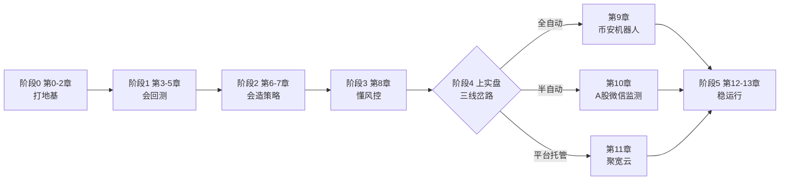

# 量化交易零基础实战教程（A股 + 币安 + 微信推送）

> 一个能让**零基础小白**从"不知道量化是什么"走到"**真实盘交易**"的完整教程项目。
> 全部代码在本仓库内、可直接运行、有单元测试；教程在 `docs/` 下按章组织。


---

## 🗺️ 学习路线图（5 阶段）

整个教程按 5 个阶段组织，每阶段有明确的**阶段目标**和**里程碑**（能拿出手验证的成果）：

| 阶段 | 章节 | 你能做什么 | 里程碑（可验证成果） |
|------|------|-----------|---------------------|
| 0 打地基 | 第 0~2 章 | 装环境、Python 入门、听懂量化黑话 | 自检全绿 + 跑通第一个回测命令 |
| 1 会回测 | 第 3~5 章 | 下载数据、跑通并理解回测、看懂绩效表 | 独立读懂双均线回测的每一行 |
| 2 会造策略 | 第 6~7 章 | 自己提假设、造因子、做样本外验证、识别过拟合 | 产出一份样本外验证报告 |
| 3 懂风控 | 第 8 章 | 回答"买多少"、设止损与账户纪律 | 给策略配上仓位 + 止损 |
| 4 上实盘 | 第 9~11 章 | 三线岔路（见下） | 真实小资金下单 或 信号空跑验证 |
| 5 稳运行 | 第 12~13 章 | 7×24 部署、排错、持续迭代 | 服务器稳定运行 + 上线/下线决策 |



**三线岔路**（阶段 4 按目标市场分岔，用户自选，互不冲突）：

| 路线 | 市场 | 交易方式 | 核心工具 | 章节 |
|------|------|----------|----------|------|
| 🪙 全自动 | 币安等加密货币 | 机器人自动下单（先测试网后真钱） | ccxt | 第 9 章 |
| 🇨🇳 半自动 | A股/ETF | 机器人**监测+微信推送信号，你手动下单** | 东方财富接口 + Server酱/企业微信 | 第 10 章 |
| ☁️ 平台托管 | A股/美股回测与模拟盘 | 聚宽云端平台，零运维 | 聚宽 | 第 11 章 |

> A 股为什么"手动下单"？合规门槛 + 强制人工复核 = 新手最好的风控，详见第 10 章开篇。

---

## ⚡ 快速开始（约 30 分钟，其中装依赖占大头）

```bash
# 0. 获取代码（拿到这个项目本身）
git clone <仓库地址> 量化        # 或直接下载 ZIP 解压；GitHub 访问慢可用镜像加速
cd 量化

# 1. 创建虚拟环境（Python ≥ 3.10）
python -m venv .venv

# 2. 激活虚拟环境
#    Windows PowerShell（若报"禁止运行脚本"，先执行下面第二行的解锁命令）:
.venv\Scripts\Activate.ps1
#    Set-ExecutionPolicy -ExecutionPolicy RemoteSigned -Scope CurrentUser   ← 解锁一次即可
#    Windows Git Bash:   source .venv/Scripts/activate
#    Mac/Linux:          source .venv/bin/activate
#    （不想折腾激活？跳过激活，直接用 .venv\Scripts\python.exe 代替 python 也可）

# 3. 安装依赖（默认走清华镜像，大陆速度起飞；海外可去掉 -i 参数）
pip install -r requirements.txt -i https://pypi.tuna.tsinghua.edu.cn/simple

# 4. 创建配置文件（不填任何密钥也能跑通前 6 章）
copy .env.example .env      # Mac/Linux 用 cp

# 5. 环境自检：哪里有问题一眼看出来
python scripts/setup_check.py

# 6. 下载真实数据并跑第一个回测（沪深300ETF，2018年至今）
python code/ch04_backtest/run_dual_ma.py
```

看到"回测绩效指标"表格和 `data/output/dual_ma_510300.png` 净值图，你就已经完成一次
**真实数据、含手续费滑点、无未来函数**的专业级回测了。之后按章节往下走。

---

## 📂 目录结构

```
量化/
├── README.md                 ← 你在这里
├── requirements.txt          依赖清单
├── .env.example              配置模板（复制为 .env 后填写密钥）
├── docs/                     📖 教程正文（14 章，按顺序读）
│   ├── 00-学习路线图与环境搭建.md
│   ├── 01-Python零基础速成.md
│   ├── 02-量化核心概念.md
│   ├── 03-数据获取.md
│   ├── 04-第一个策略-双均线回测.md
│   ├── 05-绩效评估与回测进阶.md
│   ├── 06-策略研究与开发.md        ← 新增：怎么自己造一个策略
│   ├── 07-参数优化过拟合样本外验证.md  ← 新增：怎么验证策略能不能上实盘
│   ├── 08-仓位管理与风控.md
│   ├── 09-币安实盘-加密货币交易.md
│   ├── 10-A股监测与微信推送.md
│   ├── 11-聚宽平台实战.md
│   ├── 12-部署与运维.md
│   ├── 13-常见问题FAQ与进阶路线.md
│   └── 附录-术语表.md             40 个术语的"人话版"词典
├── code/                     💻 全部可运行代码
│   ├── common/               配置加载 / 微信推送 / 交易所工厂 / 状态
│   ├── ch03_data/            数据获取（东方财富 / akshare / ccxt）
│   ├── ch04_backtest/        教学版回测引擎 + 策略函数库
│   ├── ch05_metrics/         绩效指标计算与画图
│   ├── ch06_risk/            仓位计算器（固定比例/ATR/凯利）
│   ├── ch07_binance/         币安实盘机器人（dry-run→testnet→实盘）
│   ├── ch08_monitor/         A股监测机器人（信号→微信→手动下单）
│   ├── ch09_joinquant/       聚宽策略（粘贴即用）
│   ├── research/             策略研究（第 6-7 章）：信号库 / 参数扫描 / 样本外验证
│   └── tests/                pytest 单元测试
├── solutions/                📝 各章"动手环节"参考答案与讲解
├── scripts/                  环境自检 / verify_all 一键通关 / Docker / 定时任务示例
└── data/                     运行时生成：CSV缓存、净值图、状态文件
```

> 💡 **离线没数据 / 想快速自检？** `python code/ch03_data/make_sample_data.py` 生成固定种子样例数据，
> 再 `python code/ch04_backtest/run_dual_ma.py --csv data/sample_prices.csv --no-plot` 即可离线回测；
> `python scripts/verify_all.py` 一键验证"数据 → 单测 → 回测 → 产物"全链路可跑通。

> 💡 **代码目录名 = 语义模块（不随章节号变），文档章节号 = 学习顺序**。例如 `code/ch04_backtest/`
> 对应第 4 章，但 `code/ch06_risk/`（仓位计算器）对应第 8 章——目录名里的数字是"模块诞生时的
> 章节"，之后章节重排不再改目录名，避免破坏代码引用。每章正文都会明确写出"本章代码在哪个目录"。

---

## ✅ 项目特性

- **零基础友好**：每一章都有"学习目标 / 正文 / 动手环节 / 常见的坑"，Python 不熟也能跟上（第 1 章速成）
- **代码即教材**：教学版自写回测引擎、逐行中文注释，不用黑盒框架，读懂数学
- **真实且严谨**：无未来函数（信号次根开盘成交）、手续费 + 滑点建模、81 个单元测试护体
- **大陆网络可用**：A 股走东方财富公开接口；币安公共行情走 `data-api.binance.vision` 直连；币安**测试网**可直连拿假钱练手
- **安全阶梯**：dry-run（不下单）→ testnet（假钱）→ 实盘（三重确认），每一步都可回退
- **微信触达**：Server酱 / PushPlus / 企业微信三选一，免费

## 🚦 实盘前的红线（务必阅读）

1. **先用测试网至少跑两周**，再考虑真钱；真钱第一笔 ≤ 100 USDT。
2. API Key **绝不勾选提现权限**，绑定 IP 白名单，泄露立即作废。
3. 任何策略先回测 → 再模拟盘 → 再小资金，三个关卡缺一不可。
4. 量化不是印钞机：本项目示例策略在 A 股震荡市就是跑不赢指数（第 4 章会看到），
   **如实面对回测结果**是这个教程教给你的第一课。第 9/10 章教的是执行基础设施，
   请装进你自己验证过的策略。
5. 本项目仅用于学习研究，不构成投资建议。加密货币在大陆涉及 2021 年十部门通知等
   监管约束与冻卡风险，详见第 9.2 节——真钱模式需要输入确认短语，代表你接受全部
   合规责任；请遵守所在司法辖区法律。
6. 文档中的回测数字标注了"截至"时点，会随行情漂移；以你自己重跑的结果为准。

> 📄 授权说明：`code/` 与 `scripts/` 下的代码采用 MIT；`docs/` 教程文字采用 CC BY-NC-SA 4.0（可署名转载、非商用），详见 `LICENSE`。

## 📐 项目规范

- [CONTRIBUTING.md](CONTRIBUTING.md) —— 开发/提交/文档同步规范（约定式提交、测试门禁、目标仓位契约）
- [CHANGELOG.md](CHANGELOG.md) —— 版本变更历史
- 代码 MIT、教程文字 CC BY-NC-SA 4.0，见 [LICENSE](LICENSE)

## 🙏 站在巨人的肩膀上

教程大量借力开源社区（思路与致谢，均在本仓库代码之外）：

- [ccxt](https://github.com/ccxt/ccxt) —— 100+ 交易所统一接口
- [akshare](https://github.com/akfamily/akshare) —— A股数据接口全家桶
- [聚宽 JoinQuant](https://www.joinquant.com) —— 云端量化平台（回测/模拟盘）
- [vn.py](https://github.com/vnpy/vnpy)、[backtrader](https://github.com/mementum/backtrader)、[freqtrade](https://github.com/freqtrade/freqtrade)、[Microsoft Qlib](https://github.com/microsoft/qlib) —— 进阶框架，第 13 章导读
